# NotePad-Android应用的介绍文档

## 一.初始应用的功能

### 1.新建笔记和编辑笔记
- **功能介绍**：用户可以创建新的笔记并编辑其内容
- **实现思路**：通过NoteEditor Activity提供文本编辑界面，使用LinedEditText自定义控件实现带行号的编辑功能
- 新建笔记显示效果
  点击页面中的“新建笔记”按钮
  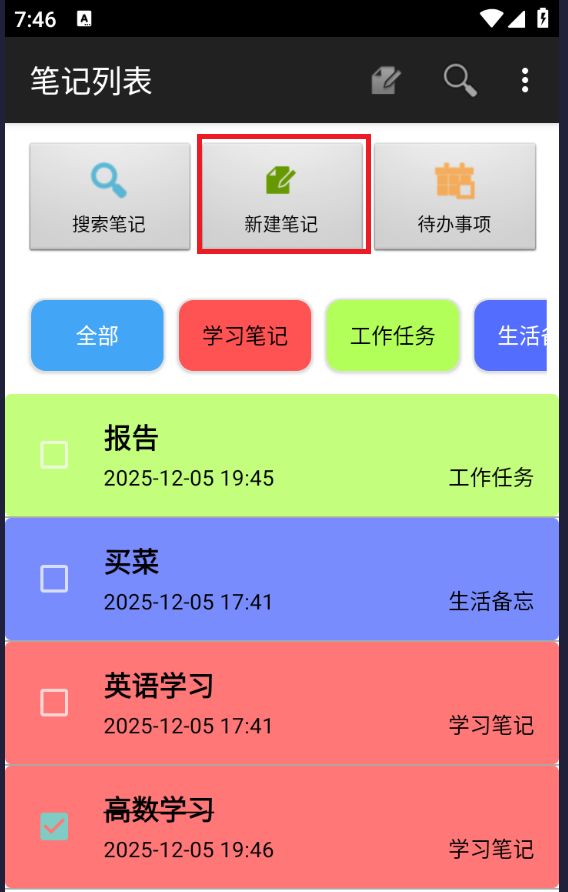
- 编辑笔记显示效果
  (1)点击“新建笔记”或者长按笔记列表中的任意笔记项，进入编辑界面
  (2)在编辑界面中，用户可以修改笔记的分类，标题和内容
  
- 新增笔记成功显示效果
  (1)用户在编辑界面完成输入后，点击保存按钮
  (2)系统会将用户输入的分类、标题和内容保存到数据库中
  (3)返回笔记列表界面，用户可以在列表中看到新增的笔记
  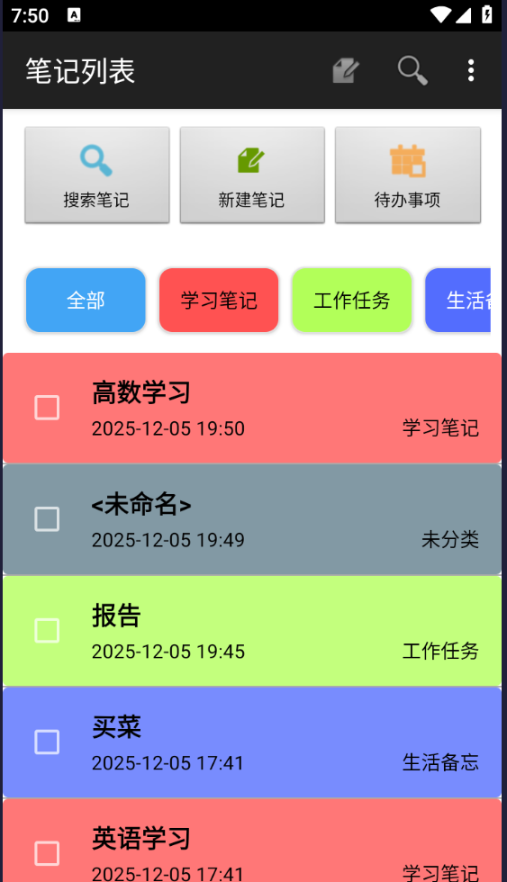
### 2.编辑标题
- **功能介绍**：用户可以为笔记设置标题
- **实现思路**：通过TitleEditor Activity提供标题编辑界面，支持修改笔记标题
- 编辑标题显示效果
  (1)长按点击笔记列表中的任意笔记项，进入编辑界面
  (2)在编辑界面中，用户可以修改笔记的标题
  
  (3)用户完成输入后，点击保存按钮
  (4)系统会将用户输入的标题保存到数据库中
  (5)返回笔记列表界面，用户可以在列表中看到更新后的标题
  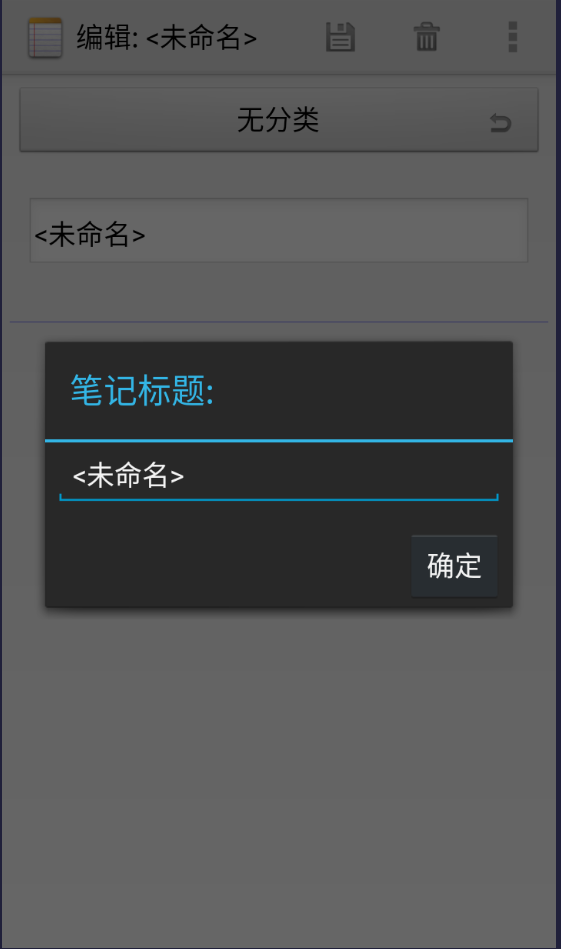

### 3.笔记列表
- **功能介绍**：显示所有笔记的列表，支持查看和管理笔记
- **实现思路**：通过NotesList Activity实现，使用ListView显示笔记列表，CursorAdapter处理数据绑定
- 笔记列表显示效果
  (1)在笔记列表界面，用户可以看到所有已创建的笔记
  (2)每个笔记项显示标题、分类以及时间戳
  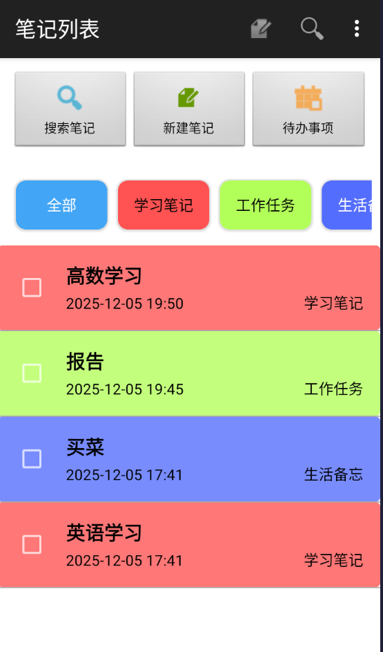

## 二.拓展基本功能

### 1.笔记条目增加时间戳显示

#### 1.1 功能介绍
每个新建笔记都会保存新建时间并显示；在修改笔记后更新为修改时间，用户可以直观地看到笔记的创建和修改时间。

#### 1.2 实现思路和技术实现
- **实现思路**：
  1. 在笔记列表item布局中添加一个TextView用于显示时间
  2. 在数据库查询时获取修改时间字段
  3. 使用SimpleDateFormat格式化时间戳为可读格式
  4. 通过ViewBinder将时间数据绑定到对应的TextView

- **技术实现**：

**布局文件修改 (notes_row.xml)**
```xml
<LinearLayout xmlns:android="http://schemas.android.com/apk/res/android"
    android:id="@+id/layout"
    android:layout_width="match_parent"
    android:layout_height="match_parent"
    android:orientation="vertical">
    <!-- 原标题TextView -->
    <TextView
        android:id="@android:id/text1"
        android:layout_width="match_parent"
        android:layout_height="?android:attr/listPreferredItemHeight"
        android:textAppearance="?android:attr/textAppearanceLarge"
        android:gravity="center_vertical"
        android:paddingLeft="5dip"
        android:singleLine="true" />
    <!-- 添加显示时间的TextView -->
    <TextView
        android:id="@+id/text2"
        android:layout_width="match_parent"
        android:layout_height="wrap_content"
        android:textAppearance="?android:attr/textAppearanceSmall"
        android:paddingLeft="5dip"
        android:textColor="@android:color/darker_gray"
        android:singleLine="true" />
</LinearLayout>
```

**时间格式化与绑定 (NotesList.java)**
```java
// 时间格式化方法
private String formatDate(long timestamp) {
    SimpleDateFormat sdf = new SimpleDateFormat("yyyy-MM-dd HH:mm", Locale.getDefault());
    return sdf.format(new Date(timestamp));
}

// 适配器数据绑定
adapter.setViewBinder(new SimpleCursorAdapter.ViewBinder() {
    @Override
    public boolean setViewValue(View view, Cursor cursor, int columnIndex) {
        if (columnIndex == COLUMN_INDEX_MODIFICATION_DATE) {
            long timestamp = cursor.getLong(columnIndex);
            String formattedDate = formatDate(timestamp);
            ((TextView) view).setText(formattedDate);
            return true;
        }
        return false;
    }
});
```

#### 1.3 实现效果界面截图
- 笔记列表时间戳显示效果
  在笔记列表界面，每个笔记项显示新建时间或最近修改时间
  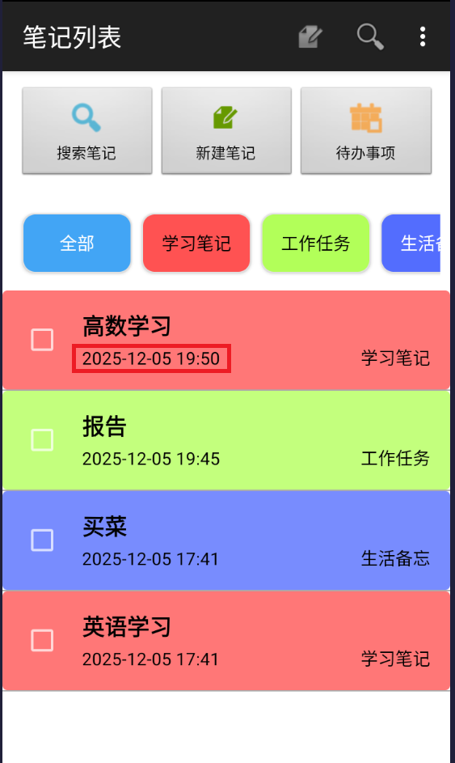

### 2.笔记查询功能

#### 2.1 功能介绍
点击搜索按钮进入搜索界面，根据输入的关键词搜索笔记标题，实时显示符合条件的笔记，支持动态更新搜索结果。

#### 2.2 实现思路和技术实现
- **实现思路**：
  1. 在主界面添加搜索按钮
  2. 创建搜索界面布局，集成SearchView控件
  3. 实现SearchView的搜索监听，根据输入内容动态过滤笔记
  4. 使用ContentResolver查询匹配的笔记数据

- **技术实现**：

**搜索按钮布局 (notes_list.xml)**
```xml
<!-- Search button -->
<LinearLayout
    android:id="@+id/search_button"
    android:layout_width="0dp"
    android:layout_height="match_parent"
    android:layout_weight="1"
    android:orientation="vertical"
    android:gravity="center"
    android:clickable="true"
    android:background="@android:drawable/btn_default">
    <ImageView
        android:layout_width="32dp"
        android:layout_height="32dp"
        android:src="@android:drawable/ic_menu_search"
        android:tint="@android:color/holo_blue_dark" />
    <TextView
        android:layout_width="wrap_content"
        android:layout_height="wrap_content"
        android:text="搜索笔记"
        android:layout_marginTop="4dp"
        android:textColor="@android:color/black"
        android:textSize="12sp" />
</LinearLayout>
```

**搜索功能实现 (NotesList.java)**
```java
// 搜索按钮点击事件
searchButton.setOnClickListener(new View.OnClickListener() {
    @Override
    public void onClick(View v) {
        // 创建搜索对话框
        AlertDialog.Builder builder = new AlertDialog.Builder(NotesList.this);
        View searchView = LayoutInflater.from(NotesList.this).inflate(R.layout.search_dialog, null);
        builder.setView(searchView);
        final SearchView sv = searchView.findViewById(R.id.search_view);
        final ListView searchListView = searchView.findViewById(R.id.search_results_list);
        
        // 搜索监听
        sv.setOnQueryTextListener(new SearchView.OnQueryTextListener() {
            @Override
            public boolean onQueryTextSubmit(String query) {
                performSearch(query);
                return true;
            }
            
            @Override
            public boolean onQueryTextChange(String newText) {
                performSearch(newText);
                return true;
            }
            
            private void performSearch(String query) {
                String selection = NotePad.Notes.COLUMN_NAME_TITLE + " LIKE ?";
                String[] selectionArgs = new String[] { "%" + query + "%" };
                
                Cursor cursor = getContentResolver().query(
                        NotePad.Notes.CONTENT_URI,
                        PROJECTION,
                        query.isEmpty() ? null : selection,
                        query.isEmpty() ? null : selectionArgs,
                        NotePad.Notes.DEFAULT_SORT_ORDER
                );
                
                // 更新搜索结果列表
                adapter.changeCursor(cursor);
            }
        });
        
        builder.show();
    }
});
```

#### 2.3 实现效果界面截图
- **标题**：笔记搜索功能效果
  (1)用户点击搜索笔记按钮，弹出搜索对话框
  (2)用户输入关键词后，系统会实时过滤笔记标题，显示符合条件的笔记
  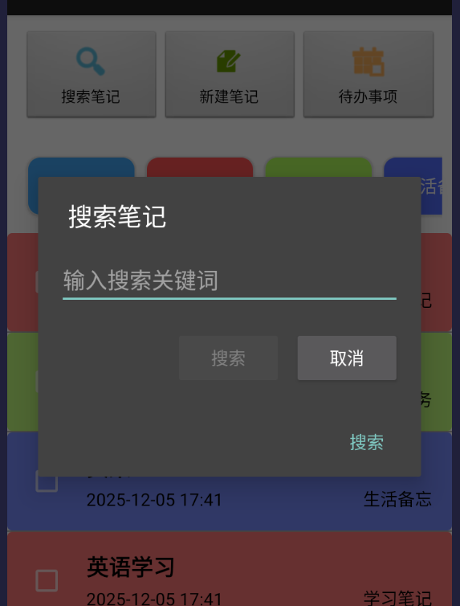
  
  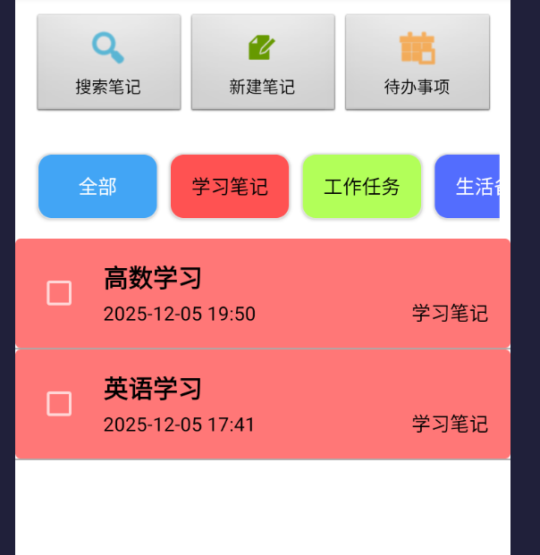

## 三.拓展附加功能

### 1.笔记分类

#### 1.1 功能介绍
支持为笔记添加分类，用户可以创建、编辑和删除分类，并根据分类筛选笔记。

#### 1.2 实现思路和技术实现
- **实现思路**：
  1. 在数据库中创建分类表
  2. 实现CategoryManager Activity用于分类管理
  3. 在笔记列表中添加分类过滤功能
  4. 在笔记编辑时支持选择分类

- **技术实现**：

**分类表定义 (NotePad.java)**
```java
public static final class Categories implements BaseColumns {
    private Categories() {}
    public static final String TABLE_NAME = "categories";
    public static final Uri CONTENT_URI = Uri.parse(SCHEME + AUTHORITY + "/categories");
    public static final String DEFAULT_SORT_ORDER = "name ASC";
    public static final String COLUMN_NAME_NAME = "name";
    public static final String COLUMN_NAME_COLOR = "color";
    public static final String COLUMN_NAME_CREATE_DATE = "created";
}
```

**分类过滤实现 (NotesList.java)**
```java
// 加载分类按钮
private void loadCategories() {
    LinearLayout categoryLayout = findViewById(R.id.category_filter_container);
    categoryLayout.removeAllViews();
    
    // 添加所有分类按钮
    Button allButton = new Button(this);
    allButton.setText("全部");
    allButton.setTag(-1L);
    allButton.setOnClickListener(new View.OnClickListener() {
        @Override
        public void onClick(View v) {
            filterByCategory(-1L);
        }
    });
    categoryLayout.addView(allButton);
    
    // 查询并添加所有分类
    Cursor categoryCursor = getContentResolver().query(
            NotePad.Categories.CONTENT_URI,
            new String[]{NotePad.Categories._ID, NotePad.Categories.COLUMN_NAME_NAME},
            null,
            null,
            NotePad.Categories.DEFAULT_SORT_ORDER
    );
    
    if (categoryCursor != null) {
        while (categoryCursor.moveToNext()) {
            long categoryId = categoryCursor.getLong(categoryCursor.getColumnIndex(NotePad.Categories._ID));
            String categoryName = categoryCursor.getString(categoryCursor.getColumnIndex(NotePad.Categories.COLUMN_NAME_NAME));
            
            Button categoryButton = new Button(this);
            categoryButton.setText(categoryName);
            categoryButton.setTag(categoryId);
            categoryButton.setOnClickListener(new View.OnClickListener() {
                @Override
                public void onClick(View v) {
                    filterByCategory((Long) v.getTag());
                }
            });
            categoryLayout.addView(categoryButton);
        }
        categoryCursor.close();
    }
}

// 分类过滤方法
private void filterByCategory(long categoryId) {
    String selection = null;
    String[] selectionArgs = null;
    
    if (categoryId != -1L) {
        selection = NotePad.Notes.COLUMN_NAME_CATEGORY_ID + " = ?";
        selectionArgs = new String[]{String.valueOf(categoryId)};
    }
    
    Cursor cursor = getContentResolver().query(
            NotePad.Notes.CONTENT_URI,
            PROJECTION,
            selection,
            selectionArgs,
            NotePad.Notes.DEFAULT_SORT_ORDER
    );
    
    adapter.changeCursor(cursor);
}
```

#### 1.3 实现效果界面截图
- **标题**：笔记分类管理界面
  (1)用户点击分类管理按钮，进入分类管理界面
  (2)在分类管理界面，用户可以添加、编辑和删除分类
  (3)用户可以为每个分类设置名称和颜色
  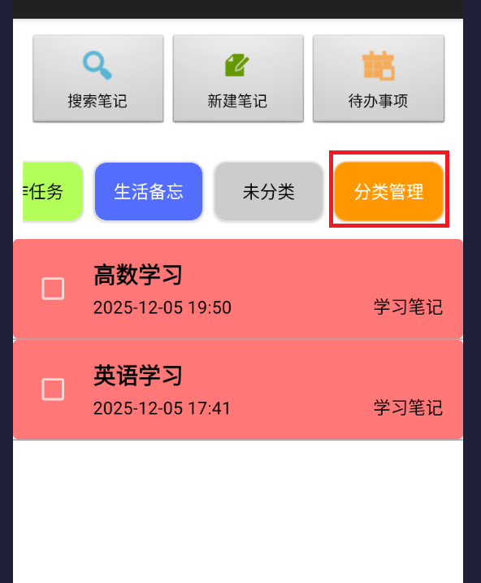
  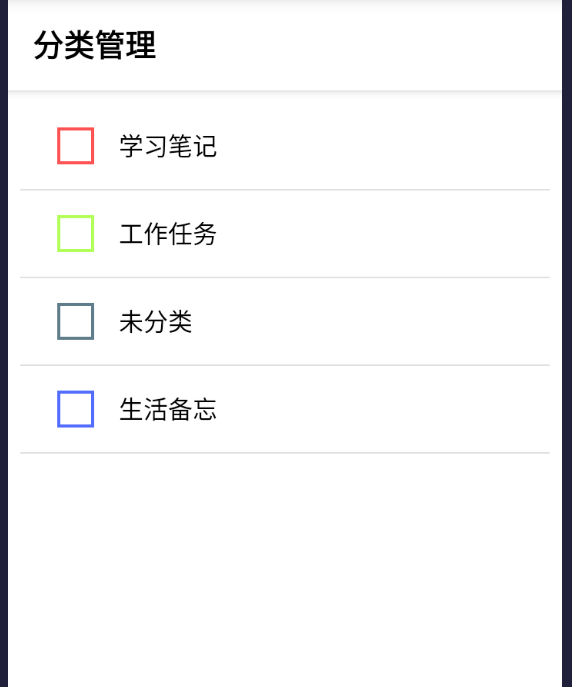
  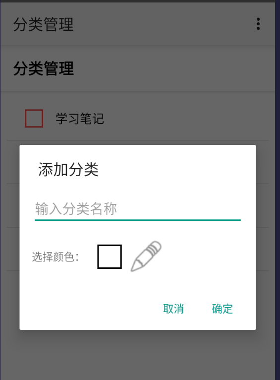
  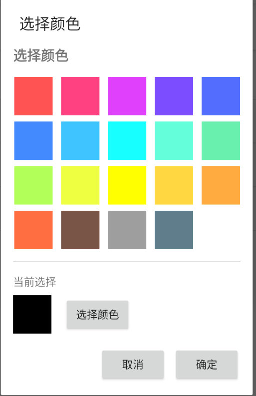
- **标题**：笔记分类过滤效果
  (1)用户可以在笔记列表中根据分类进行筛选
  (2)点击分类按钮后，笔记列表会显示该分类下的所有笔记
  (3)用户可以点击"全部"按钮返回所有笔记
  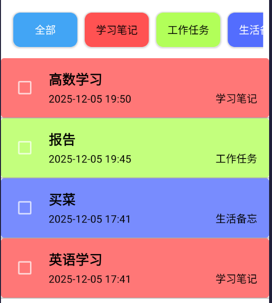
  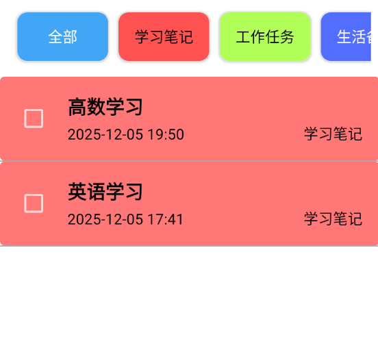
  

### 2.添加代办功能

#### 2.1 功能介绍
支持创建待办事项笔记，用户可以标记待办事项的完成状态，完成的事项会显示删除线。

#### 2.2 实现思路和技术实现
- **实现思路**：
  1. 在笔记表中添加完成状态字段
  2. 在笔记列表中添加复选框用于标记完成状态
  3. 实现完成状态的实时更新和UI反馈

- **技术实现**：

**笔记表添加完成状态字段 (NotePad.java)**
```java
public static final class Notes implements BaseColumns {
    // ... 其他字段
    public static final String COLUMN_NAME_COMPLETED = "completed";
}
```

**待办功能实现 (NotesList.java)**
```java
// 复选框点击事件处理
else if (columnIndex == COLUMN_INDEX_COMPLETED) {
    final boolean completed = cursor.getInt(columnIndex) == 1;
    final CheckBox checkBox = (CheckBox) view;
    final long noteId = cursor.getLong(COLUMN_INDEX_ID);
    final TextView titleView = (TextView) rootView.findViewById(R.id.text1);
    
    checkBox.setChecked(completed);
    
    if (completed) {
        titleView.setPaintFlags(titleView.getPaintFlags() | android.graphics.Paint.STRIKE_THRU_TEXT_FLAG);
    } else {
        titleView.setPaintFlags(titleView.getPaintFlags() & (~android.graphics.Paint.STRIKE_THRU_TEXT_FLAG));
    }
    
    checkBox.setOnClickListener(new View.OnClickListener() {
        @Override
        public void onClick(View v) {
            boolean newCompletedState = checkBox.isChecked();
            updateNoteCompletionStatus(noteId, newCompletedState);
            
            if (newCompletedState) {
                titleView.setPaintFlags(titleView.getPaintFlags() | android.graphics.Paint.STRIKE_THRU_TEXT_FLAG);
            } else {
                titleView.setPaintFlags(titleView.getPaintFlags() & (~android.graphics.Paint.STRIKE_THRU_TEXT_FLAG));
            }
        }
    });
    return true;
}

// 更新完成状态方法
private void updateNoteCompletionStatus(long noteId, boolean completed) {
    ContentValues values = new ContentValues();
    values.put(NotePad.Notes.COLUMN_NAME_COMPLETED, completed ? 1 : 0);
    values.put(NotePad.Notes.COLUMN_NAME_MODIFICATION_DATE, System.currentTimeMillis());
    
    getContentResolver().update(
            Uri.withAppendedPath(NotePad.Notes.CONTENT_URI, String.valueOf(noteId)),
            values,
            null,
            null
    );
}
```

#### 2.3 实现效果界面截图
- **标题**：待办事项功能效果
  (1)用户可以点击待办事项功能按钮，进入待办任务清单界面。
  (2)待办任务清单会显示所有未完成的待办事项
  (3)用户可以在待办任务清单中标记完成状态
  (4)完成的待办事项会显示删除线
  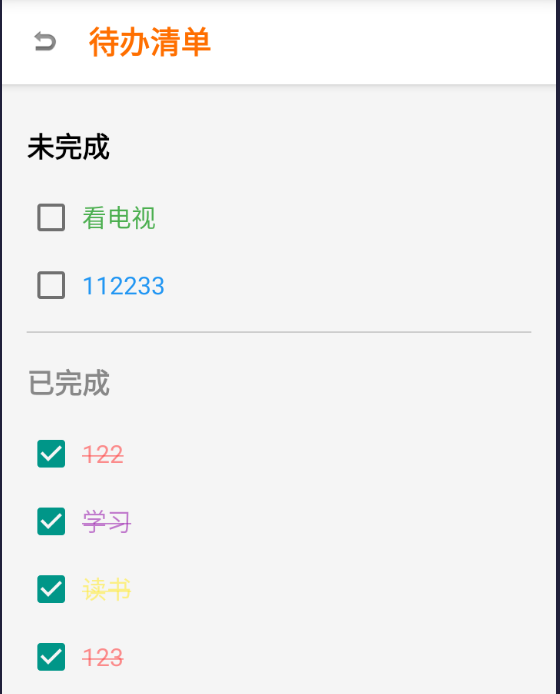
  也为笔记添加了待办选项，同样勾选后可以标记为已完成，显示删除线。
  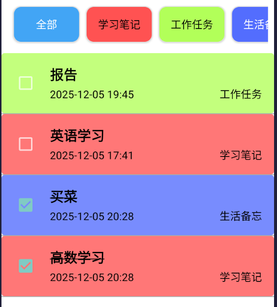

### 3.UI美化

#### 3.1 功能介绍
对应用界面进行美化，包括主题切换、笔记背景颜色设置和界面布局优化。

#### 3.2 实现思路和技术实现
- **实现思路**：
  1. 修改应用主题，将暗黑风格改为白亮风格
  2. 实现笔记背景颜色设置功能
  3. 优化界面布局，添加渐变效果和阴影

- **技术实现**：

**主题切换 (AndroidManifest.xml)**
```xml
<activity
    android:name=".NotesList"
    android:label="@string/title_notes_list"
    android:theme="@android:style/Theme.Holo.Light">
</activity>
```

**笔记背景颜色实现 (NotesList.java)**
```java
// 背景颜色常量
private static final int[] BACKGROUND_COLORS = {
        android.R.color.white,
        android.R.color.holo_blue_light,
        android.R.color.holo_green_light,
        android.R.color.holo_orange_light,
        android.R.color.holo_purple
};

// 设置笔记背景颜色
private void setNoteBackgroundColor(long noteId, int colorResId) {
    ContentValues values = new ContentValues();
    values.put(NotePad.Notes.COLUMN_NAME_BACK_COLOR, colorResId);
    values.put(NotePad.Notes.COLUMN_NAME_MODIFICATION_DATE, System.currentTimeMillis());
    
    getContentResolver().update(
            Uri.withAppendedPath(NotePad.Notes.CONTENT_URI, String.valueOf(noteId)),
            values,
            null,
            null
    );
}
```

#### 3.3 实现效果界面截图
- **标题**：笔记背景颜色设置界面
  (1)用户可以在笔记编辑界面中选择笔记的背景颜色
  (2)用户可以在笔记列表中根据背景颜色进行筛选
  (3)用户可以在分类管理界面中为分类设置背景颜色
  
  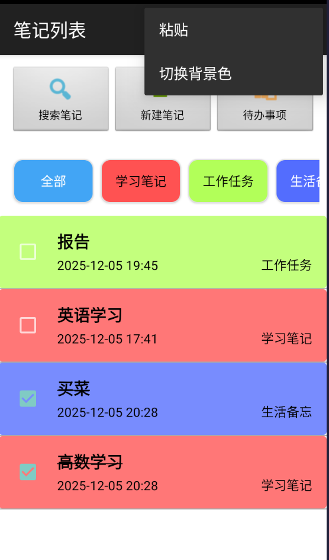
  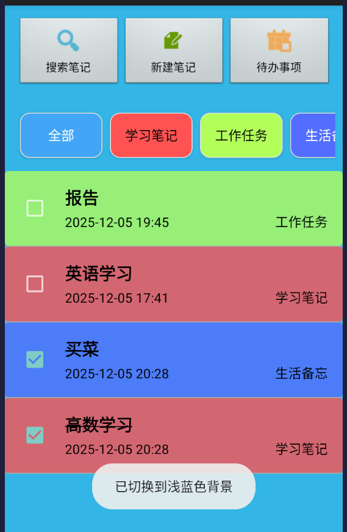

## 四.技术总结

### 1.核心技术栈
- **数据存储**：SQLite数据库 + ContentProvider
- **界面实现**：ListView + CursorAdapter
- **异步处理**：AsyncQueryHandler
- **搜索功能**：SearchView
- **自定义控件**：LinedEditText

### 2.项目结构
```
NotePad/
├── app/
│   ├── build.gradle            # 应用级构建文件
│   └── src/
│       ├── androidTest/        # 自动化测试代码
│       └── main/               # 主要代码目录
│           ├── AndroidManifest.xml  # 应用配置文件
│           ├── java/com/example/android/notepad/  # Java源代码
│           │   ├── NoteEditor.java      # 笔记编辑页面
│           │   ├── NotesList.java       # 笔记列表页面
│           │   ├── NotePad.java         # 数据模型定义
│           │   ├── NotePadProvider.java # ContentProvider实现
│           │   ├── CategoryManager.java # 分类管理页面
│           │   └── TodoList.java        # 待办清单页面
│           └── res/                     # 资源文件
│               ├── drawable/            # 图片和样式资源
│               ├── layout/              # 布局文件
│               ├── menu/                # 菜单配置
│               └── values/              # 字符串、颜色等配置
├── build.gradle                # 项目级构建文件
├── gradle/                     # Gradle包装器
├── gradlew                     # Gradle命令行工具（Unix）
├── gradlew.bat                 # Gradle命令行工具（Windows）
└── settings.gradle             # 项目设置
```

## 五.使用说明

### 1.基本操作
- **创建笔记**：点击"新建笔记"按钮
- **编辑笔记**：在笔记列表中点击任意笔记
- **删除笔记**：长按笔记条目，选择删除
- **搜索笔记**：点击搜索按钮，输入关键词

### 2.高级功能
- **分类管理**：点击分类管理按钮，添加、编辑或删除分类
- **待办事项**：使用复选框标记事项完成状态
- **背景颜色**：在笔记编辑时设置笔记背景颜色

## 六.版本历史

- **v1.0.0**：基础版本，实现笔记的增删改查
- **v1.1.0**：添加时间戳显示和搜索功能
- **v1.2.0**：实现笔记分类和待办功能
- **v1.3.0**：UI美化和背景颜色设置